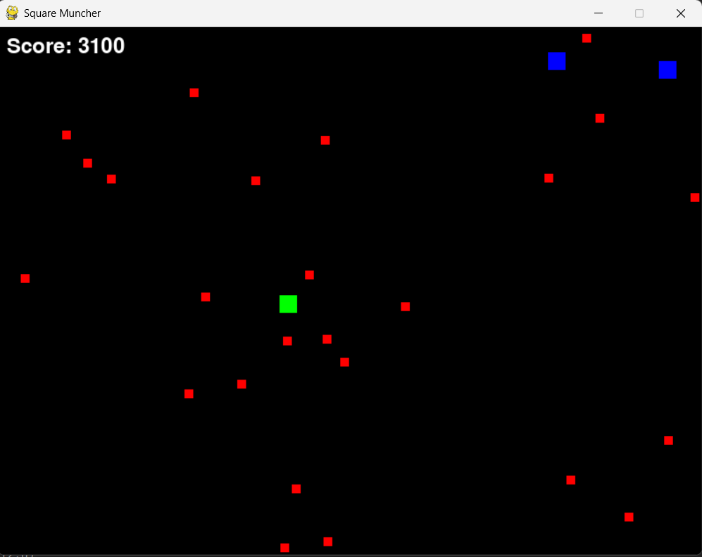

# Square Muncher

## Project Overview

A Python arcade-style game built with **Pygame**, where players control a green square that eats red squares for points while avoiding blue enemies. The game combines real-time movement, collision detection, and basic motion patterns to create a survival challenge.

---

## Project Goals

**Core Functions**

* Smooth player control using keyboard input (arrow keys)
* Randomly moving food (red squares) and enemies (blue squares)
* Score tracking and display
* Game over and restart functionality
* Title screen with instructions

---

## Tech Stack

* **Language:** Python
* **Library:** Pygame
* **Modules:** random, pygame

---

## Game Design

### Mechanics

* **Player:** Green square that can move in four directions within screen bounds
* **Food:** Small red squares moving randomly; increase score when eaten
* **Enemies:** Larger blue squares moving faster; collision triggers game over
* **Title & Game Over Screens:** Interactive states guiding the player

### Key Features

* Dynamic object motion with bounce logic at screen edges
* Collision detection for food and enemies
* Automatic reset and replay system

---

## Development Overview

| Phase                  | Tasks Completed                     |
| ---------------------- | ----------------------------------- |
| Setup & Initialization | Display window, object definitions  |
| Player Controls        | Movement, boundary checks           |
| Game Objects           | Food and enemy generation           |
| Collision Logic        | Score updates and game over states  |
| UI & Screens           | Title screen, restart screen, score |
| Testing & Balancing    | Spawn behavior                      |
